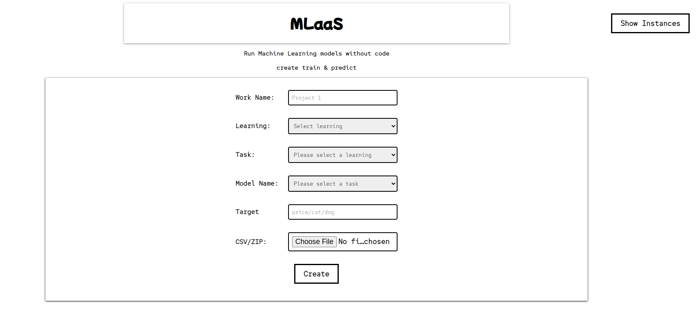
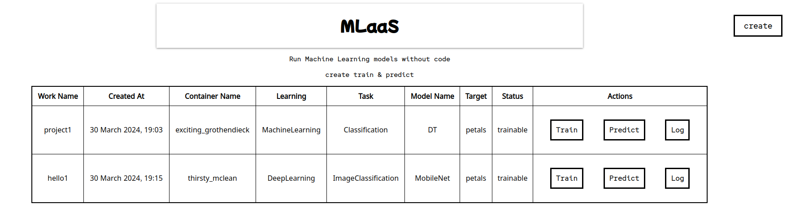

# MLaaS 

## CSE484 (Cloud Computing) Project

Run ML/DL models without code. Just create train & predict

# Packages

* Express.js
* Dockerode
* Pycaret
* Handlebars
* Docker

# How to run

1. First make sure you have node, npm and docker installed in your machine.

2. Clone or download the git repository

   ```shell
   git clone https://github.com/eniac00/MLaaS.git
   ```

3. Go to the `MLaaS` directory 

   ```shell
   cd MLaaS
   ```

4. Build the docker image name `heart` using the command below

   ```shell
   docker build -t heart .
   ```

5. After building the image just install the dependencies and run the server

   ```shell
   npm install
   npm run dev
   ```
6. Visit `localhost:3000` using any browser.


# Screenshots




